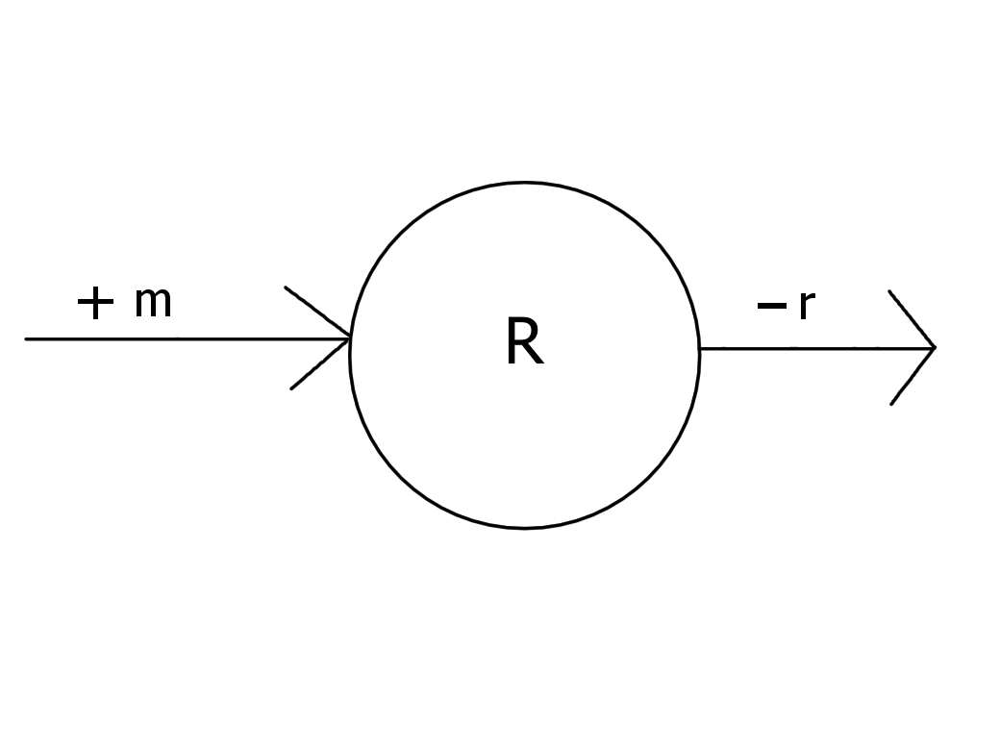

```{r setup, include=FALSE}
knitr::opts_chunk$set(echo = TRUE)
```

# Introduction
In this research mRNA dynamic is programmed.  

The number of mRNA transcripts is researched by means of the rate in decay of existing transcripts and the number of new transcripts produced per second. This resulted in the answer to the question: "What is the difference in number of mRNA over time, in different conditions?". To answer this question multiple sub questions, need to be answered. These questions include: 

- "What is the difference in number of mRNA over time, when the system is at the steady state?" 

- "What is the difference in number of mRNA over time, when mRNA is increasing over time?" 

- "What is the difference in number of mRNA over time, when mRNA is decreasing over time?" 


## Goal

The goal of this project is to simulating the amount of mRNA transcripts over time in 3 various conditions: 

1. System is in steady state. 
2. Number of mRNA is increasing over time. 
3. Number of mRNA is decreasing over time. 

The expectation differs between the conditions. The first hypothesis, H0, is: There is no difference in the number of mRNA transcripts over time. The second hypothesis, H1, is: There is difference in the number of mRNA transcripts over time.  

To reach the goal the R package deSolve is used. There are two parameters programmed: r and m. Also, the time over which the number of mRNA is programmed. By using the “euler”-method the number of mRNA transcripts is calculated.  

## Theory


```{r, echo=FALSE, out.width='95%'}
#
```
This is the biological model used. R is the number of transcripts, r is the rate of decay of existing transcripts and m is the number of new transcripts produced per second

For this project a rather simple (commonly) model was used.  

$$\frac{\delta R}{\delta t} = -r * R + m $$

* R is the number of transcripts. 
* r is the rate of decay of existing transcripts. 
* m is the number of new transcripts produced per second. 

In cells mRNA transcription is a constant process. The amount of transcription is regulated by various components such as:

* Transcription factors 
* Histone methylation and acetylation 
* Enhancer sites 

Not all mRNA is used in translation, processes known as post transcriptional regulation play a role in regulating the synthesis of proteins after transcription. The amount of mRNA that is broken down has multiple factors, for example: 

* MRNA converts into RNA. 
* MRNA gets broken down by ribonuclease. 
* Nonsense-mediated decay 

The used model doesn’t factor in these individual processes but rather takes the total rate of decay and the total new transcripts per second.  


# Methods

## The software model

To make the dynamic model we made use of the deSolve package in r. The formula used for the model is dR/dt = -rR + m.

```{r}
library(deSolve)
parameters <- c(r = 0.55, m = 275) 
parameters2 <- parameters
parameters3 <- parameters
parameters2[2] <- 300
parameters3[2] <- 250


# define model 
transcripts <- function(t, R, parms){
  with(as.list(c(parms)),{
         dR <- -r * R + m
         return(list(c(dR)))
       }
       )
}

#initial state
state <- c(R = 500)

#define time sequence you want to run the model
times <- seq(0, 20,  by = 0.1)

# run simulation using continuous approach
out  <- ode(times = times, y = state,   parms = parameters, 
            func = transcripts, method = "euler")
out2 <- ode(times = times, y = state,   parms = parameters2, 
            func = transcripts, method = "euler")
out3 <- ode(times = times, y = state,   parms = parameters3, 
            func = transcripts, method = "euler")
```

The formula dR/dt = -rR + m was implemented using a function. This function could then be used in conjunction with the r & m parameters and the initial value R. All of these values where given to the ode function, which calculated the results using the euler method.

Three different outputs where generated. For each of the outputs a different m (number of new transcripts produced) was used to simulate a different scenario. The first output is the steady state scenario., the second one is the increasing over time scenario and the third one is the decreasing over time scenario.

## Model configuration

The initial state of the amount of mRNA (R) was set to 500. The parameter r was set to 0.55 which means a breakdown of 55% of the mRNA per 15 minutes and the parameter m was set to 275 which means a production of 275 mRNA per 15 minutes, this gives us the system in a steady state from the start. The time sequence was set to be run from t=0 to t=20, with steps of 0.1 to smoothen the lines. Time (t) is in chucks of 15 minutes. This time sequence was chosen to give a good representation of the fact that the line flattens at a certain point, and reaches a new equilibrium. For the increased and decreased senarios the m was lowered or raised by 25 mRNA per 15 minutes depending on the situation. These values for the rate of decay was chosen based on the TFIID gene as described by this study \cite{Timmers18}.
It is important to note that we used a 15 minute time frame instead of per second. This is simply because of the fact that the values we based our model on from the previously sited source are also given per 15 minutes.

\begin{longtable}[l]{l|l|l}
\caption{Parameter Values} \\ \hline
\label{param_table}
$\textbf{Parameter}$             &$\textbf{Value}$& $\textbf{Unit}$              \\ \hline
\endhead
$r$       & 0.55   & $percentage/15min$            \\ \hline
$m$       & 275    & $mRNA/15min$                  \\ \hline
$R$       & 500    & $mRNA$                        \\ \hline
\end{longtable}


# Results
```{r}
plot(out, out2, out3, main = "ammount of mRNA transcripts over time", 
     ylab="number of mRNA transcripts", xlab="timepoint", 
     lty=1, col = c("black", "purple", "orange"))
legend(x = 15, y = 495, lty = 1, col = c("black", "purple", "orange"), 
       legend = c("Steady", "Increase", "Decrease"))
```

This research is conducting an experiment to look at the difference in number of mRNA, in different conditions in time. In figure 1, the amount of mRNA transcripts over time, is shown. The black line is the line that displays the number of mRNA changes over time when a system is at the steady state. In the steady state is there no difference in number because the rate of decay of existing transcripts is the same amount as the number of new transcripts produced. We accept the H0 hypothesis. 

There are changes in the number of mRNA over time when the system is not steady, which means the system either increases or decreases in the number of mRNA.  
In figure 1, the purple line displays the number of mRNA when the number of mRNA is increasing over time. This means that the number of new transcripts produced is higher than the rate of decay of existing transcripts. Over time the system is reaches an equilibrium state, in this state the number of new transcripts produced is equal to the rate of decay of existing transcripts. 
The yellow line in figure 1, displays the number of mRNA when the number of mRNA is decreasing over time. This means that the rate of decay of existing transcripts is higher than the number of new transcripts produced. This system also, reaches an equilibrium state, which means that the number of new transcripts produced is equal to the rate of decay of existing transcripts. 
In both of these cases we reject the H0 hypothesis and accept H1 hypothesis.  


# Discussion and Conclusion
## Discussion
Our results are in line with what we would expect from literature on the subject. One of the things that could have been done better was using a rate of decay in seconds instead of in chucks of 15 minutes. An actual rate of decay in mRNA per second however seems to be hard to find in literature, which is why we decided to use the per 15 minutes time chucks. We could have also just made up some numbers to run the scenarios, however it seems more fitting to use actual data instead of some made up numbers.

## General conclusion and perspective
The goal was to simulate the amount of mRNA over time in three different scenarios using a dynamic model. This goal was achieved.
This project could be expanded in the future by making a more sophisticated dynamic model to simulate the amount of mRNA transcripts that takes into account more variables.


\begin{thebibliography}{9}

\bibitem{Soertaert10}
Soetaert, K., Petzoldt, T., and Woodrow Setzer, R.: \textit{Solving differential equations in R: package deSolve}, J. Stat. Softw., 33, 1-25, 2010.

\end{thebibliography}
