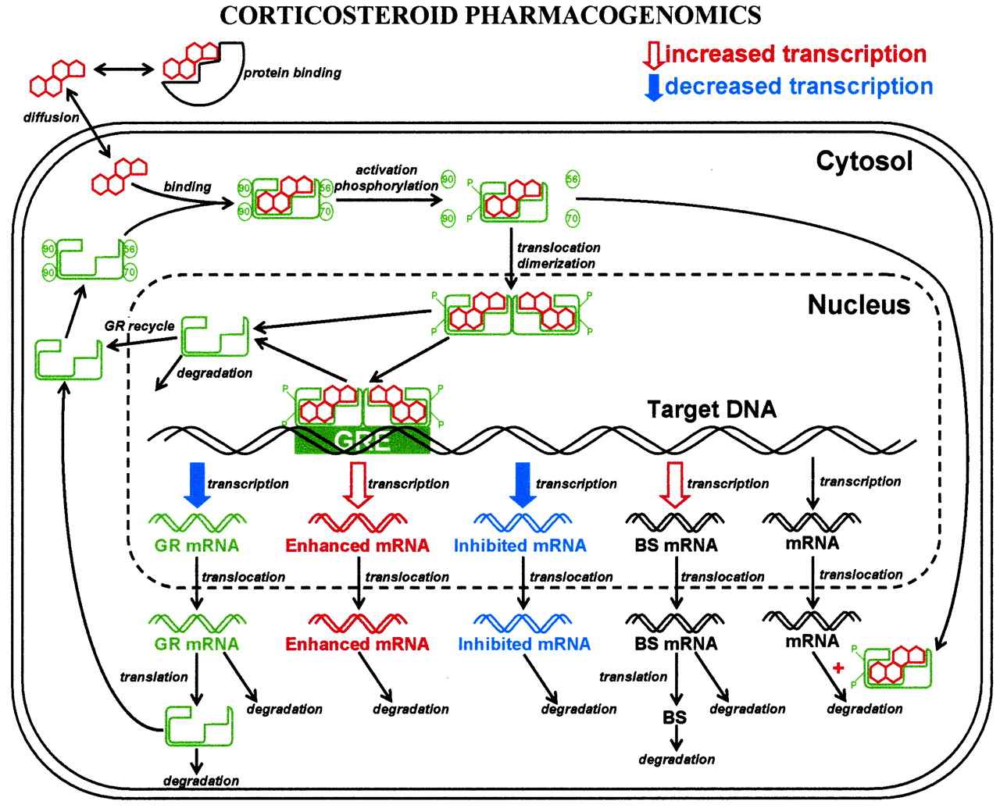

```{r setup, include=FALSE}
knitr::opts_chunk$set(echo = TRUE)
```

# Introduction  
This research is implementing a model for the expression of glucocorticoid receptors (GR), in which down-regulation by corticosteroids is present.  

Corticosteroids are used for the treatment of many chronic inflammatory and immune diseases, including asthma. These diseases are characterized by inflammation of the airways. 

## Goal
Simulating the dynamics of glucocorticoid receptor while under the influence of glucocorticoid. Using deSolve and R according to a 2011 paper by Barnes. 

## Theory

Currently glucocorticoids are the most effective anti-inflammatory therapy for asthma but are yet relative ineffective when used for treatment of chronic obstructive pulmonary disease (COPD). The underlying mechanism is by supressing multiple inflammatory genes by reversing histone acetylation of these active genes. (2011, Barnes) Glucocorticoids diffuse across the cell membrane and can bind to glucocorticoid receptors (GR). The glucocorticoid receptors in turn homodimerize and bind to glucocorticoid response elements (GRE) in the promoter region of glucocorticoid-responsive genes and this interaction switches gene transcription on (or on occasion off) \cite{Barnes11}. *Figure 1* shows a more in depth view of the pathway. 
  
```{r, echo=F, out.width='50%', fig.align="center", fig.cap="Source: Journal of pharmacology and experimental therapeutics vol 307, No.1"}

```

Naturally these glucocorticoids are synthetised as a reaction on factors such as: 

* Low blood sugar 
* Stress 
* Trauma 

These glucocorticoids are responsible for multiple homeostatic functions such as metabolism, immune system. The primary changes which glucocorticoids cause are increasing blood sugar levels, increase of metabolism rate, slowing inflammation, lowering bone synthesis and changes in emotional state.  

The changes which glucocorticoids cause on the rate of inflammation makes this an interesting path in reducing inflammation. There are various conditions in which reducing inflammation is a desired effect such as: asthma, organ transplants and auto-immune diseases.   

Give an explanation of the model with citations of source \cite{Soertaert10} (replace this with actual source)
and formula explanation

```{r, echo=F, out.width='50%', fig.align="center", fig.cap="Source: flowdiagram glucocorticoide receptor dynamica"}
knitr::include_graphics('images/model.png')
```

The biological model is shown if *Figure 2*. The model consist of the following four formulas:

$$\frac{\delta mRNA_{r}}{\delta t} = k_{s\_Rm} \cdot (1 - \frac{DR(N)}{IC_{50\_Rm} + DR(N)}) - k_{d\_Rm} \cdot mRNA_{r}$$
This is the formula for calculating the difference in mRNAr over time. k~s_Rm~ is the a constant depicting the speed of the synthesis of the mRNA for the receptor protein. This constant is then multiplied by the following equation. 
$$(1 - \frac{DR(N)}{IC_{50\_Rm + DR(N)}})$$ 
This is because DR(N) serves a repressor for the synthesis of the mRNA. This part of the formula stands for the amount of repression. DR(N) is the amount of MPL-receptor complex in the nucleus. IC~50_Rm~ is the consentration of DN(N) at which the production of mRNA is decreased by 50%.
k~s_Rm~ is another constant that stands for the amount of mRNAr that is degenerated over time. This is a first order constant, which is why it is multiplied by the current amount of mRNAr.


$$\frac{\delta R}{\delta t} = k_{s\_R} \cdot mRNA_{r} + R_{f} \cdot k_{re} \cdot DR(N) - k_{on} \cdot D \cdot R - k_{d\_R} \cdot R$$
This is the formula for calculating the difference in free glucocorticoid receptor density over time. k~s_R~ and k~d_R~ are both first order constants for the production and degeneration of the receptors, respectively. R~f~ is the fraction of the free receptors that gets recycled. k~re~ is also a first-order rate constant. This constant stands for the receptors in the nucleus that are "recovered" and are translocated over the nuclear membrane from the nucleus to the cytosol.
In this formula k~on~ is the only second-order rate constant, depicting the speed of the production of the MPL-receptor complex.


$$\frac{\delta DR}{\delta t} = k_{on} \cdot D \cdot R - k_{T} \cdot DR$$
This is the formula for calculating the difference in MPL-receptor complex density over time. k~on~ is a second-order rate constant, depicting the speed of the production of the MPL-receptor complex. k~t~ is a first-order rate constant for the speed of translacation of the MPL-receptor complex over the nuclear membrane from the cytosol to the nucleus.


$$\frac{\delta DR(N)}{\delta t} = k_{T} \cdot DR - k_{re} \cdot DR(N)$$
This is the formula for calculating the difference in MPL-receptor complex in the nucleus density over time. k~T~ is a first-order rate constant for the speed of translacation of the MPL-receptor complex over the nuclear membrane from the cytosol to the nucleus. The last peramater in this formula is k~re~. This parameter is a first-order rate constant for the receptors in the nucleus that are "recovered" and get translocated over the nuclear membrane from the nucleus to the cytosol.


# Methods

## The software model
The dynamic model was programmed in r using the deSolve package. 

All the formulas were implemented using a function. This function calculates the difference over time for all the variables. The function was given all the parameters and initial values using a vector. All the parameters and the function where then given to the ode function, which calculated the results using the euler method. 

The outputs where then plotted using the plot function.

```{r}
library(deSolve)

parameters <- c(ks_rm = 2.90,
                IC50_rm = 26.2,
                kon = 0.00329,
                kt = 0.63,
                kre = 0.57,
                Rf = 0.49,
                kd_r = 0.0572,
                kd_rm = 0.612,
                ks_r = 3.22,
                D = 20*1000/374.471)

state <- c(MRNAr = 4.74,
           R = 267,
           DR = 0,
           DRn = 0)

Gluco <- function(t, state, parameters) {
  with(as.list(c(state, parameters)),{
    # rate of change
    dMRNAr <- ks_rm * (1 - DRn/(IC50_rm + DRn)) - kd_rm * MRNAr
    dR <- ks_r * MRNAr + Rf * kre * DRn - kon * D * R - kd_r * R
    dDR <- kon * D * R - kt * DR
    dDRn <- kt * DR - kre * DRn
    
    # return the rate of change
    list(c(dMRNAr, dR, dDR, dDRn))
  }) # end with(as.list ...
}

times <- seq(0, 48, by = 0.01)


out <- ode(y = state, times = times, func = Gluco, parms = parameters)
```

## Model configuration

The parameters and initial values that were used where chosen based on the values given by this website \cite{Bioinf}. The values originated from experiments done with methylprednisolon on rats. The MPL concentration was 20 ng/ml. For the model we needed this value in nmol/L. 20 ng/ml equated to 20 * 1000 / 374,471 nmol/L. This value was used as the value for parameter D. 
The model will be simulated for a timeframe of two days. Seeing as the parameters used are per hour this means we'll have to use a time sequence of 0 to 48 hours. This means the experiment will run from t=0 till t=48. The steps in the time sequence where set to 0.01 to smoothen the resulting lines in the plots. Below are two tables showing all the paramaters and variables and thier values.

\begin{longtable}[l]{l|l|l}
\caption{Parameter Values} \\ \hline
\label{param_table}
$\textbf{Parameter}$             &$\textbf{Value}$& $\textbf{Unit}$              \\ \hline
\endhead
$k_{s\_RM}$       & 2.90            & $fmol/g \  liver/h$      \\ \hline
$IC_{50\_Rm}$     & 26.2            & $fmol/mg \ protein$     \\ \hline
$k_{on}$          & 0.00329         & $L/nmol/h$            \\ \hline
$k_{T}$           & 0.63            & $1 / h$               \\ \hline
$k_{re}$          & 0.57            & $1 / h$               \\ \hline
$Rf$              & 0.49            & $ $                   \\ \hline
$k_{d\_R}$        & 0.0572          & $1 / h$               \\ \hline
$k_{d\_Rm}$       & 0.612           & $ $                   \\ \hline
$k_{s\_r}$        & 3.22            & $ $                   \\ \hline
$D$               & 20*1000/374.471 & $nmol/L$              \\ \hline
\end{longtable}

\begin{longtable}[l]{l|l|l}
\caption{Initial Values} \\ \hline
\label{param_table}
$\textbf{Variable}$         &$\textbf{Initial Value}$& $\textbf{Unit}$      \\ \hline
\endhead
$R_{m0}$        & 4.74      & $fmol/g \ liver$        \\ \hline
$R_{0}$         & 267       & $fmol/g \ protein$      \\ \hline
$DR$            & 0         & $fmol/g \ protein$      \\ \hline
$DR(N)$         & 0         & $fmol/g \ protein$      \\ \hline
\end{longtable}


# Results
Introduction of results, how does it answer your research questions.
```{r Figure_1, fig.cap="Results of the dynamic model"}
#plot(out)
#code to generate figures with title, subscripts, legenda etc
par(las=1)
plot(out, xlab = "Time (h)", 
     ylab = c("Conc. (fmol/g)",
              "Conc. protein (fmol/mg)",
              "Conc. protein (fmol/mg)",
              "Conc. protein (fmol/mg)"), 
     main = c("Receptor mRNA (liver)",
              "Free receptor",
              "Drug-receptor complex",
              "Activated receptor complex"),
     col="purple",
     ylim = list(c(0,5),
                 c(0,300),
                 c(0,50),
                 c(0,50)))
```

The model displayed in *Figure 3* shows that the amount of free receptors drastically decreases as time goes on until a new equilibrium is reached. This is to be expected as over time more of the free receptors will be bound by the drug, until at one point there is a balance between the amount of receptors produced and the amount of drugs that can bind in a specific timeframe.

Looking at the concentration of the MPL-receptor complex in the cytosol in *Figure 3*, we can observe a rapid increase until around 5 hours. After this point the concentration begins to decrease towards a new equilibrium. This rapid increase at the start can be attributed to the rather long time it takes for the complex to be translocated over the nuclear membrane. The rapid decrease after the peak can be explained by the decrease of free receptors over time. Seeing as over time the number of free receptors decreases, the amount of MPL-receptor complex that can be formed also decreases. So, the spike we see at around 5 hours seem to be an accumulation of this complex that simply hasn't been translocated yet. 

Because the concentration of the activated MPL-receptor complex in the nucleus is heavily dependent on the concentration of the MPL-receptor complex in the cytosol, we can observer a similar trend when it comes to the concentration of this complex over time. The peak in the concentration of the activated complex is later then the peak of the complex in the cytosol. This is because of the still elevated levels of the MPL-receptor complex in the cytosol. Because of this high concentration, more of the complex will be translocated to the nucleus. This is the cause of the time difference between the peaks.

When it comes to the mRNAr levels we can observe a rapid decrease followed by a slight increase until an equilibrium is found at around t=25. The concentration of mRNAr follows the same trend as the activated MPL-receptor complex but in reverse. This explains the rapid decrease followed by a slight increase in concentrates seeing as the concentration of the activated MPL-receptor complex also increases or decreases at these moments respectively. These results are to be expected seeing as the activated MPL-receptor complex in the nucleus serves as a repressor for the transcription of mRNAr. 

The most important variable for the efficiency of the medicine is the concentration of the activated MPL-receptor complex in the nucleus. This complex functions a repressor/inhibitor for certain genes commonly associated with the immune system.


# Discussion and Conclusion
## Discussion
- Compare your results with what is expecting from the literature and discuss differences with them.
- Discuss striking and surprising results.
- Discuss weaknesses in your research and how they could be addressed.

Our results are in line with what we would expect from literature on the subject.
There seem to be no significant deviations in results from what we would expect when comparing to literature on the subject.
The experiment could possibly be improved by using parameters for a smaller time frame, so instead of per hour we would use parameters of a rate of change per minute. This will however only have a very small and possibly insignificant effect on the result. A future improvement that could cause a significant change in results would be the incorporation of even more relatively small and seemingly insignificant parameters in the dynamic model.

## General conclusion and perspective
Improving the dynamic model by incorporating more paramaters.
The goal was to simulate the dynamics of glucocorticoid receptors while under the influence of glucocorticoids. This goal was achieved.
Possible future improvement to this project would include the implementation of a more sophisticated dynamic model that takes more variables and parameters into account when simulating the results.


\begin{thebibliography}{9}

\bibitem{Barnes11}
Barnes, Peter J.: \textit{Glucocorticosteroids: current and future directions}, British journal of pharmacology, 163.1, 29-43, 2011.

\bibitem{Bioinf}
Feenstra, F.: \textit{Expressie van glucocorticoid receptoren}, Hanze University of Applied Science.

\end{thebibliography}
